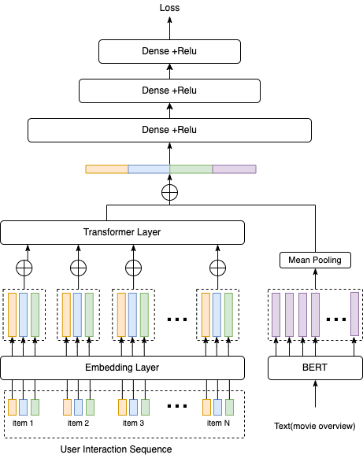

<a name="readme-top"></a>

# Transformer-based Recommendation for Movies



## About The project


What are we trying to do?
- Make the basic pieces of a recommender system, with MovieLens-1m data!

> The whole thing is in `Movielens.ipynb`, which, if you run top to bottom, will go through the steps of preprocessing the data, all the way to a baby neural network you can work with!


## Getting Started

### Prerequisites

If you have Python on your computer, and Jupyter notebook installed, great! The rest of the requirements are in `requirements.txt`:

```
pip install -r requirements.txt
```

### Usage

You can open Jupyter here, and navigate to the `/data` directory afterwards:
```
jupyter lab .
```

## Overview

There are many MovieLens-1M recommenders out there, but this is the one I could make in a few hours! (and with the instructions kindly provided).

We go through five stages:
1. Data exploration/cleaning
2. Preprocessing
3. Modelling
4. Training
5. Evaluation & Production

### Dataset

We use a combination of MovieLens-1M data (users/ratings/movies) with other movie metadata (movie descriptions).

### Data cleaning & preprocessing

The metadata is actually really useful. However, it's a bit hard to match (using a naive join only links ~50% of the records). So, we use fuzzy matching to fully match the data.

It seems that this works quite well.

https://pbpython.com/record-linking.html

### Modelling

If you look carefully, what we implemented is NOT what is in the picture.

The Tencent model uses the user's **interaction sequence** as the basis for future recommendations. However, we just shove the user's features into the transformer layer (roughly equivalent to just Item 1 and Item 2). This has pro's and con's.

### Evaluation & Production

Lots of work remains here! Making the model servable, with a good interface, is something that we probably have to think about _before_ making the model! In this particular implementation, sadly, it is not super useful yet!

## Contributing

If you have a suggestion that would make this better, please fork the repo and create a pull request. You can also simply open an issue with the tag "enhancement".

Don't forget to give the project a star! Thanks again!


Zen Tang - [@other_adventure](https://twitter.com/other_adventure)

[Clone this repository](https://github.com/your_username/other_rec)

<p align="right">(<a href="#readme-top">back to top</a>)</p>
